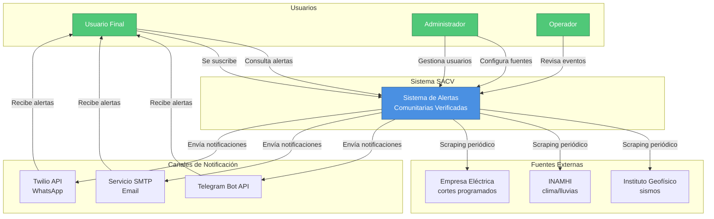
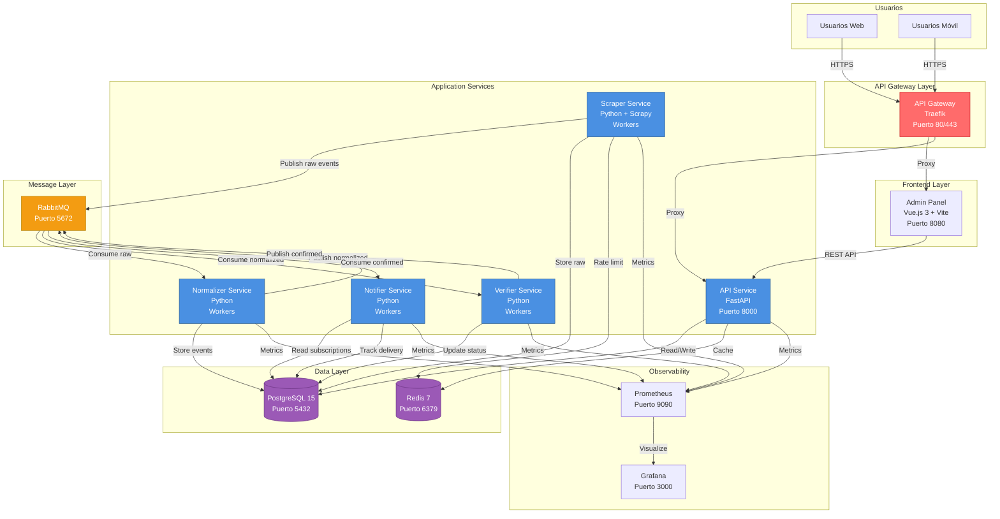
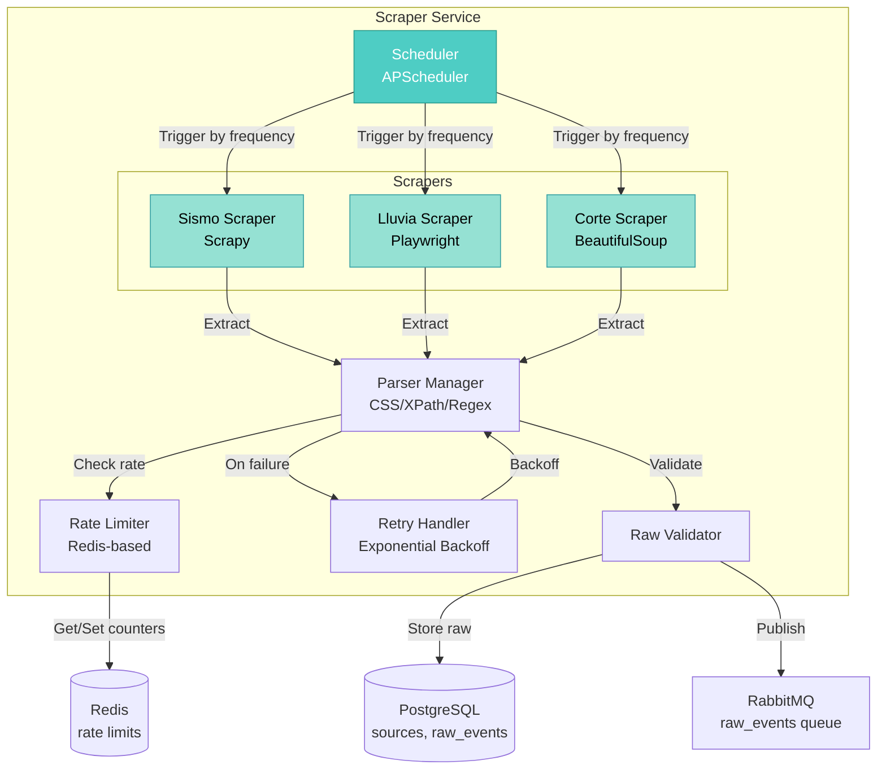
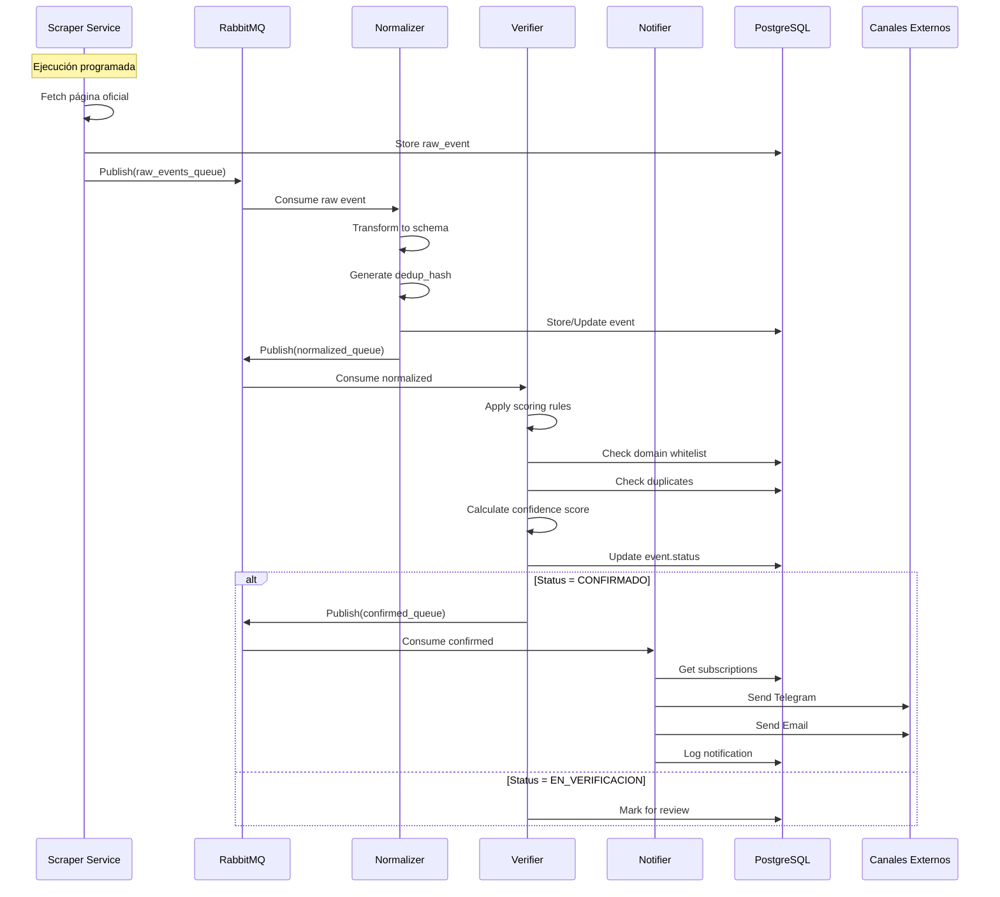
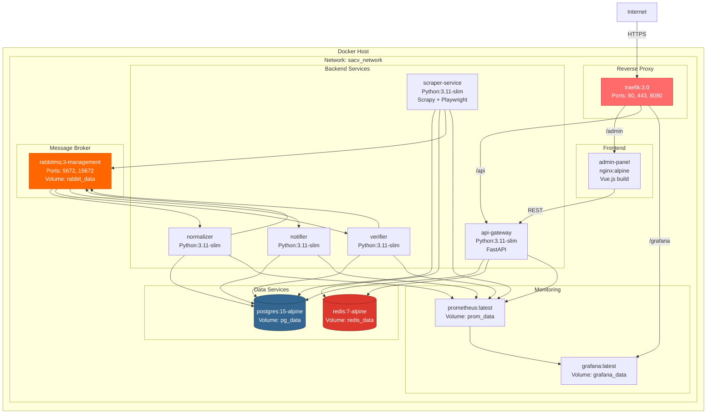
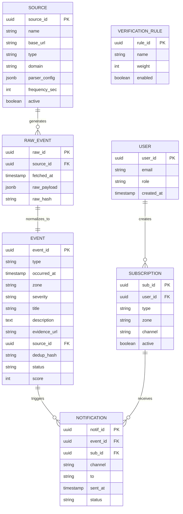

# Sistema de Alertas Comunitarias Verificadas - Arquitectura

## 1. Diagrama de Contexto (C4 Level 1)

## 2. Diagrama de Contenedores (C4 Level 2)

## 3. Diagrama de Componentes - Scraper Service (C4 Level 3)

## 4. Flujo de Datos Event-Driven

## 5. Arquitectura de Despliegue - Docker Compose

## 6. Modelo de Datos Simplificado

## 7. Tecnologías y Versiones (100% Free/Open Source)

| Componente | Tecnología | Versión | Licencia | Justificación |
|------------|------------|---------|----------|---------------|
| **Backend** | Python | 3.11+ | PSF | Ecosistema scraping superior |
| **Web Framework** | FastAPI | 0.109+ | MIT | Async, OpenAPI, alto rendimiento |
| **Scraping** | Scrapy | 2.11+ | BSD | Framework completo para crawling |
| **Dynamic Scraping** | Playwright | 1.40+ | Apache 2.0 | Headless browser automation |
| **HTML Parsing** | BeautifulSoup4 | 4.12+ | MIT | Simple parsing estático |
| **Database** | PostgreSQL | 15+ | PostgreSQL | ACID, JSONB, event sourcing |
| **Cache** | Redis | 7+ | BSD | Pub/sub, rate limiting |
| **Message Broker** | RabbitMQ | 3.12+ | MPL 2.0 | AMQP, reliable messaging |
| **API Gateway** | Traefik | 3.0+ | MIT | Cloud-native, auto-discovery |
| **Frontend** | Vue.js | 3.3+ | MIT | Progressive framework |
| **UI Library** | Vuetify | 3.4+ | MIT | Material Design components |
| **Build Tool** | Vite | 5.0+ | MIT | Fast dev server |
| **Container** | Docker | 24+ | Apache 2.0 | Containerization |
| **Orchestration** | Docker Compose | 2.23+ | Apache 2.0 | Multi-container apps |
| **Metrics** | Prometheus | 2.48+ | Apache 2.0 | Time-series metrics |
| **Dashboards** | Grafana | 10.2+ | AGPL 3.0 | Visualization |
| **Logging** | Structlog | 23.2+ | MIT | Structured logging |
| **Scheduler** | APScheduler | 3.10+ | MIT | Job scheduling |
| **HTTP Client** | httpx | 0.25+ | BSD | Async HTTP |
| **Telegram** | python-telegram-bot | 20.7+ | LGPL 3.0 | Telegram Bot API |
| **Email** | aiosmtplib | 3.0+ | MIT | Async SMTP |

## 8. Patrones de Arquitectura Aplicados

### Event-Driven Architecture (EDA)
- **Pub/Sub**: RabbitMQ con exchanges y queues
- **Event Sourcing**: Almacenamiento inmutable de raw_events
- **CQRS**: Separación de escritura (eventos) y lectura (API)

### Microservices Patterns
- **Service per Concern**: Scraper, Normalizer, Verifier, Notifier
- **Database per Service**: Cada servicio accede a su schema
- **API Gateway**: Traefik como punto de entrada único
- **Circuit Breaker**: Retry con exponential backoff

### Resilience Patterns
- **Retry Logic**: Exponential backoff en scrapers
- **Rate Limiting**: Redis-based para evitar bloqueos
- **Health Checks**: Liveness/readiness probes
- **Graceful Degradation**: Continuar con fuentes disponibles

## 9. Escalabilidad y Rendimiento

### Escalado Horizontal
- **Scrapers**: Múltiples workers por fuente
- **Normalizers**: Pool de workers consumiendo de queue
- **Verifiers**: Procesamiento paralelo de eventos
- **Notifiers**: Workers por canal (Telegram, Email)

### Optimizaciones
- **Caching**: Redis para respuestas API frecuentes
- **Connection Pooling**: PostgreSQL pgbouncer (opcional)
- **Async I/O**: FastAPI + httpx para operaciones no bloqueantes
- **Batch Processing**: Normalización y verificación en lotes

### Límites del Sistema (Lab Environment)
- **Eventos/día**: ~10,000
- **Usuarios concurrentes**: ~100
- **Fuentes activas**: ~10
- **Latencia scraping→notificación**: <60s (promedio)
